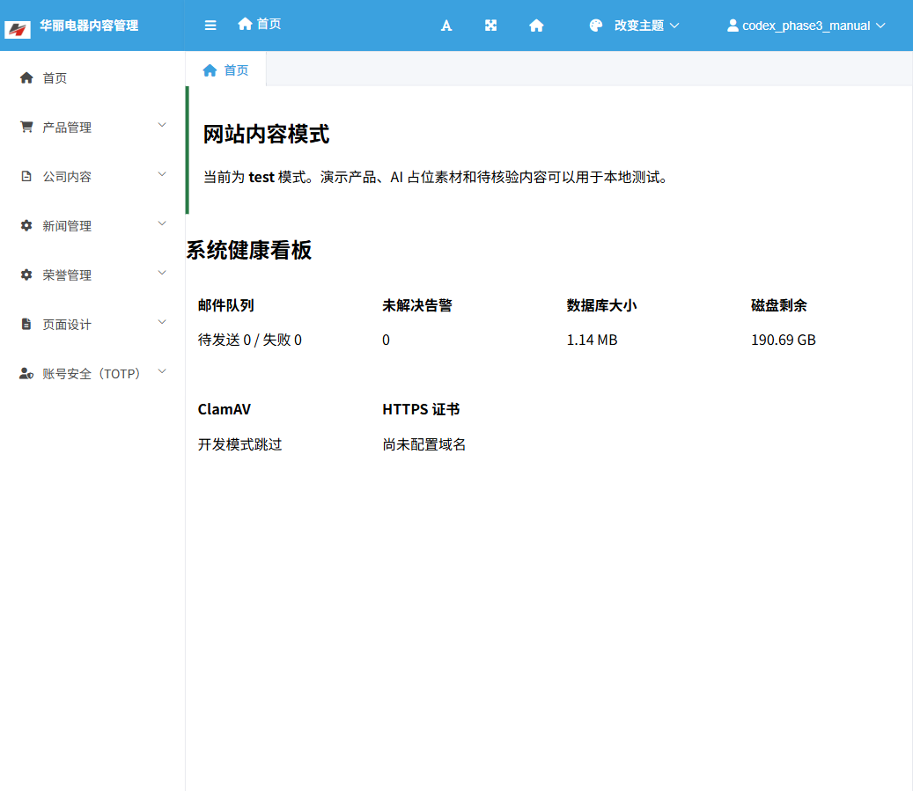
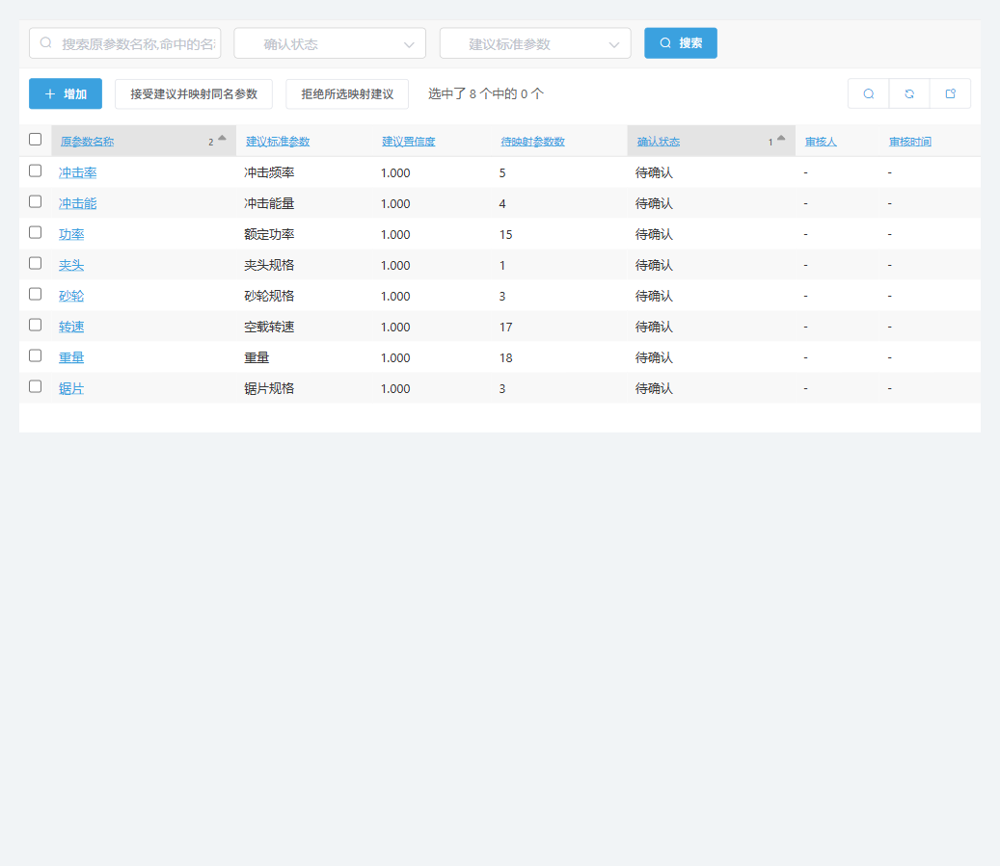
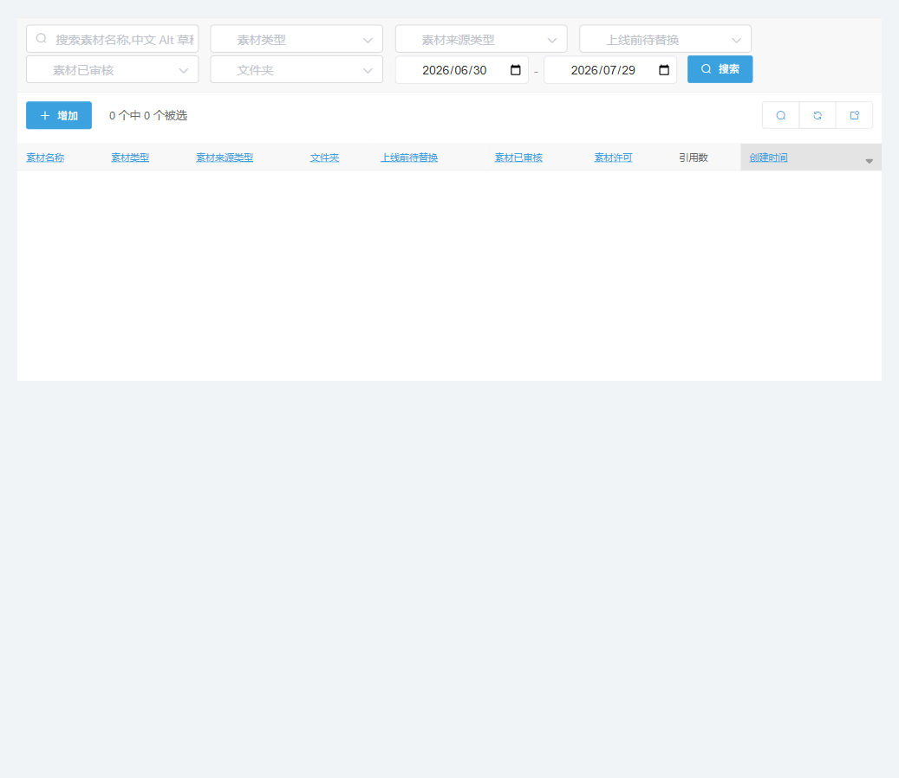

# 第三阶段操作手册

> 当前进度：里程碑一已完成，里程碑二尚未开始。

## 1. 内容模式

项目根目录 `.env` 中使用：

```env
SITE_CONTENT_MODE=test
```

- `test`：本地测试模式，可以展示 `DEMO-` 产品、AI 占位、测试新闻和待核验内容。
- `production`：正式内容模式，只展示“非演示 + 已核验”的内容，并阻止不合格内容发布。

修改 `.env` 后需要重启 Django。后台首页会显示当前模式，避免把测试数据误当成正式内容。



## 2. 初始化命令

在项目根目录运行：

```powershell
.\venv\Scripts\python.exe manage.py seed_phase3_foundation --check
.\venv\Scripts\python.exe manage.py seed_phase3_foundation
```

第一条只检查差异，不写数据库；第二条补充缺失内容。重复运行不会重复创建记录，也不会删除询盘、联系留言或邮件记录。

需要恢复被修改的演示种子内容时使用：

```powershell
.\venv\Scripts\python.exe manage.py seed_phase3_foundation --overwrite
```

`--overwrite` 只恢复该命令管理的种子内容，不会把人工已核验的真实产品或新闻改回待核验。

## 3. 后台菜单

### 公司内容

- 企业资料：公司名称、简介、成立日期、注册资本和地址。
- 企业事实与指标：可展示数字指标；演示数字必须勾选“演示内容”。
- 发展历程：按年份维护里程碑。
- 供应链内容：采购流程、核心采购品类和合作要求。
- 经销商权益：合作支持与服务内容。
- 地点与联系方式：保存工厂、总部或办事处资料。
- 常见问题：维护 FAQ 分类、问题和回答。
- 内容来源：登记网页、文件、备注、核验人和核验日期。

### 荣誉管理

当前导入的 8 条荣誉全部为“待核验”。正式使用前应补充权威来源、编号、颁发机构、日期和真实图片/PDF，再把核验状态改为“已核验”。

### 产品管理

- 标准参数字典：维护中英文名称、单位、类型和别名。
- 参数映射建议：系统扫描原参数名称后提出建议，但不会自动修改。
- 接受建议：勾选记录，在操作下拉框选择“接受建议并映射同名参数”。
- 拒绝建议：判断不准确时拒绝，避免影响后续产品对比。



### 页面设计

- 素材许可台账：记录作者、来源、许可证、署名要求和商业使用许可。
- 公开媒体库：保存原文件、桌面/手机变体、Alt、焦点、AI 提示词和待替换状态。
- 全局素材槽位：定义首页主视觉、供应链侧图等可统一替换的位置。
- 素材引用关系：查询一份素材被哪些页面或对象使用。

未知许可或不允许商业使用的素材不能审核通过。AI 素材应保留提示词、模型和“上线前待替换”标记。



媒体库列表初始为空是正常状态。里程碑一先建立许可、文件夹、标签、变体与槽位；里程碑三在页面视觉原型确认后再按模块批量生成 AI 图片、视频封面或其他媒体，避免先生成一批无法匹配最终版式的素材。

## 4. 演示内容

初始化后数据库包含：

- 12 款 `DEMO-` 概念产品
- 12 条制造知识/测试新闻
- 20 条测试 FAQ
- 8 条待核验荣誉
- 4 份双语 4 页测试 PDF

测试 PDF 位于 `media/products/documents/`，每个概念系列一份。文件内有中英文免责声明，不代表真实产品规格、认证、价格或交付承诺。

## 5. 真实内容替换

1. 在后台找到演示记录，不直接删除页面结构。
2. 上传真实图片或资料，并登记来源和许可证。
3. 填写真实公司内容、产品参数或荣誉编号。
4. 由管理员完成核验，填写核验时间。
5. 取消“演示内容”并改为“已核验”。
6. 切换到 `production` 模式检查是否仍能公开访问。

这样可以保留现有 API、页面入口和数据库关系，只替换内容本身。

## 6. 本里程碑验收

启动 Django 后访问：

- `http://localhost:8000/admin/`
- `http://localhost:8000/api/v1/site-content/`
- `http://localhost:8000/api/v1/faqs/`
- `http://localhost:8000/api/v1/honors/`
- `http://localhost:8000/api/docs/`

建议在后台依次打开“公司内容”“荣誉管理”“页面设计”“产品管理 -> 参数映射建议”，确认中文字段、筛选、编辑页和内容模式提示符合预期。

## 讲解

- **为什么有 `test/production` 两种模式**：测试站需要丰富内容验证页面，但正式网站不能公开未经核验的事实。模式开关把两种需求隔离开。
- **为什么参数只生成建议**：同名参数可能单位或语义不同，自动绑定会污染产品对比；人工确认更稳妥。
- **为什么素材必须记录许可**：图片能下载不代表能商用，许可台账让后续替换和上线审核有据可查。
